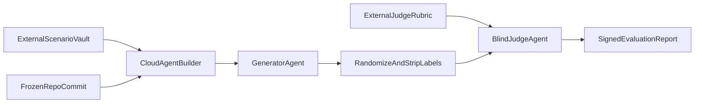

# External prompt evaluation workflow

This workflow tests whether Lede's fellowship-writing prompt improves copy
quality without relying on Lede's own critique step. It is deliberately
separate from the product workflow.

## What this can and cannot establish

The evaluation can measure whether the production prompt produces stronger
writing than a generic control on a fixed scenario set. It does not prove that
an application will win a fellowship, and an AI judge is not a substitute for
expert human review.

The in-repository demo score is a product check, not independent evidence. A
strict blind evaluation requires an external orchestrator (for example, a
Cursor Cloud Agent Builder) and a scenario vault that is not cloned with this
repository.

## Isolation model

Use three separate roles:

1. **Builder** freezes the repository commit and draws scenarios from the
   external vault.
2. **Generator** produces a treatment using the production prompt and a
   control using the generic control prompt. It does not score either result.
3. **Blind judge** receives anonymized outputs in randomized order plus the
   scoring rubric. It cannot access the repository, prompt labels, or generator
   transcript.

Never let the generator judge its own output. Do not place live benchmark
scenarios, answer keys, or judge prompts in this repository. The committed
`.gitignore` and `.cursorignore` provide defense in depth, but the canonical
vault should be a separately permissioned store or private repository.



## Source rubric

Freeze a dated copy of the rubric in the external vault. The current synthesis
uses these public sources:

- [Oxford: personal statement and statement of purpose](https://www.ox.ac.uk/admissions/graduate/application-guide/supporting-documents/statement):
  follow the course-specific prompt and limit, contextualize achievements,
  explain precise fit, and remain genuine.
- [Georgetown: crafting the personal statement](https://crf.georgetown.edu/fellowships/fellowship-applicants-toolkit/crafting-the-personal-statement/):
  write a specific, reflective, strategic argument; use pivotal experiences
  and concrete evidence; avoid résumé narration and generic claims.
- [MIT Communication Lab: fellowship personal statement](https://mitcommlab.mit.edu/nse/commkit/fellowship-personal-statement/):
  connect experience to meaning and programme match, make evidence tangible,
  and link the narrative to credible research and career goals.
- [Princeton MMUF: personal statement](https://mmuf-ebcao.princeton.edu/apply/application-components/personal-statement):
  make a thesis-like case for mutual fit, connect challenge, response, and
  learning, and show how programme features enable future contribution.
- [Yale: fellowship narrative workshop](https://funding.yale.edu/sites/default/files/files/Fellowship%20Narrative%20Workshop.pdf):
  present connected evidence about traits and motivations as a coherent,
  fellowship-specific story.

Source pages change. Record retrieval dates and archive hashes in every formal
evaluation brief. If programme instructions conflict with this synthesis, the
programme instructions control.

## Scoring contract

Score each dimension from 1 to 5:

| Dimension | Weight | A 5 requires |
| --- | ---: | --- |
| Specificity and authenticity | 20% | Details could not plausibly belong to most applicants |
| Evidence and meaning | 20% | Claims are supported, then interpreted rather than merely listed |
| Narrative causality | 15% | Experiences visibly change questions, choices, or judgment |
| Programme fit | 15% | Named features connect causally to capabilities and concrete outputs |
| Agency and future contribution | 10% | The applicant acts under ambiguity and names a credible contribution |
| Voice and restraint | 10% | Natural voice, calibrated claims, no flattery or stock AI phrasing |
| Constraint and factual fidelity | 10% | Prompt/length followed and no unsupported fact introduced |

A result is useful only when the judge cites exact text for every score and
records confidence. A factual-fidelity failure caps the total at 59/100.

## Run procedure

1. Complete `docs/EVAL_BRIEF_TEMPLATE.md`; freeze the Git SHA, model IDs,
   parameters, source-rubric version, scenario-set hash, and stopping rule.
2. Use at least 20 previously unseen scenarios spanning strong and weak source
   material, different fields, and varied programme constraints. Keep a smaller
   development set separate.
3. Generate treatment and control once per scenario with identical model,
   temperature, token budget, and source facts. The only intended difference is
   the prompt.
4. Strip metadata, randomize A/B order with a recorded seed, and send each pair
   to at least two independent judges. Add a third judge when they disagree on
   the winner or by more than one point on any dimension.
5. Report the paired score delta, win/tie/loss rate, factual-fidelity failures,
   95% bootstrap confidence interval, judge agreement, runtime, and token cost.
6. Publish all burned scenarios and outputs after the decision. Never reuse
   them as hidden tests.

## Passing rule

Set the rule before running. Recommended minimum:

- mean paired improvement of at least 5 points out of 100;
- lower bound of the 95% bootstrap interval above zero;
- no increase in factual-fidelity failures;
- treatment wins more pairs than it loses; and
- no critical subgroup is worse by more than 3 points.

If the sample is too small for the interval to be meaningful, report the run as
exploratory rather than passed.

## Local rehearsal

Create `scenarios-vault/` outside version control and place the builder,
generator, judge, and burned-example prompts there. A burned pack is suitable
only for checking orchestration. Confirm safeguards with:

```bash
git check-ignore -v scenarios-vault/behavior_scenarios.burned.example.md
git check-ignore -v any/path/behavior_scenarios-live.md
```

Do not weaken isolation merely to make a cloud run convenient. Inject the vault
through the external Builder or copy only the selected scenario into a
short-lived generator workspace.
